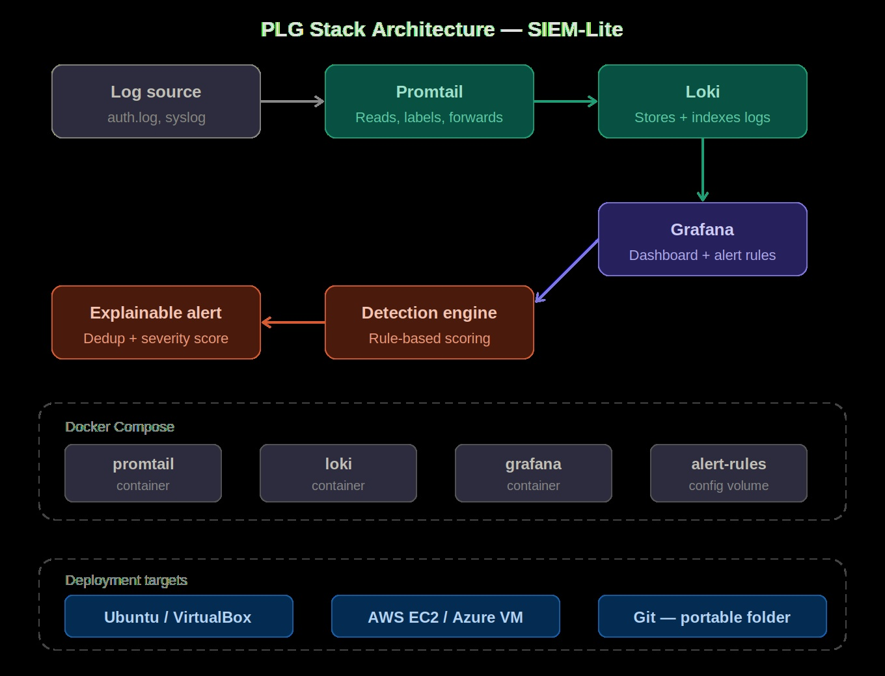
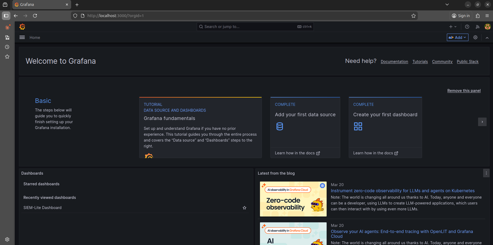
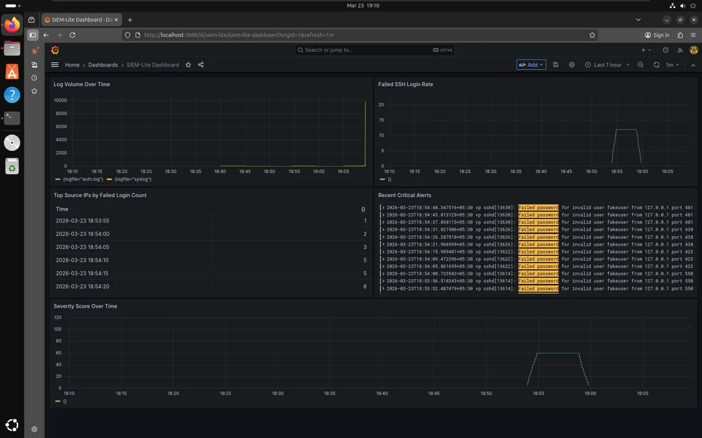

# SIEM-Lite: Cloud-Native Log Monitoring & Alerting System

> [!IMPORTANT]
> **Project Status:** Version 1.0 is now live! We are currently in the **Testing & Validation** phase, which includes:
* ✅ Core engine stability checks.
* ✅ Integration testing for log parsers.
* 🧪 Performance benchmarking under high EPS (Events Per Second).

*Use in production environments with caution during this phase.*

---

[](https://www.docker.com/)
[](https://www.python.org/)
[](https://grafana.com/)
[](./LICENSE)


## Quick Start

```bash
git clone https://github.com/vpadival/siem-lite.git
cd siem-lite
cp .env.example .env          # set your Grafana password
pip3 install -r requirements.txt --break-system-packages
docker compose up -d
```

Access the Grafana dashboard at `http://localhost:3000`.

> **Parrot OS / systems without flat log files:** install rsyslog first:
> ```bash
> sudo apt install -y rsyslog && sudo systemctl enable --now rsyslog
> sudo chmod o+r /var/log/auth.log /var/log/syslog
> ```

## Architecture

SIEM-Lite uses the PLG stack for real-time log monitoring and alerting:

- **Promtail** — collects and forwards logs from the host to Loki.
- **Loki** — aggregates and indexes log streams.
- **Grafana** — visualises logs and alerts via the Loki datasource.
- **Alert scorer** — Python engine that watches log files, matches detection rules, and emits scored alerts.



## Running the Alert Scorer

The alert scorer runs independently of Docker and watches log files directly:

```bash
python3 scripts/alert_scorer.py
```

It auto-detects log file locations for both Debian/Ubuntu (`/var/log/auth.log`, `/var/log/syslog`) and RHEL/Fedora/CentOS (`/var/log/secure`, `/var/log/messages`).

## Detection Rules

Rules are defined in `rules/detection-rules.yml`. Each rule specifies a regex pattern, severity, score, and cooldown period.

| Rule | Signal | Severity | Score |
|---|---|---|---|
| SSH brute force | 5+ failed SSH logins from same IP | High | 5 |
| Privilege escalation | sudo usage | Medium | 3 |
| After-hours login | Login between 23:00–05:00 | Low | 1 |
| New user created | useradd / adduser events | Medium | 3 |
| Direct root login | SSH login as root | Critical | 10 |
| Repeated su failures | 3+ failed su attempts | High | 5 |

## Compatibility

| Distro | Log files | Status |
|---|---|---|
| Ubuntu / Debian | `/var/log/auth.log`, `/var/log/syslog` | Supported |
| Parrot OS | Requires `rsyslog` installed | Supported |
| RHEL / CentOS / Fedora | `/var/log/secure`, `/var/log/messages` | Supported |
| Arch / systems with journal only | Requires `rsyslog` | Supported |
| macOS | Falls back to polling (no inotify) | Supported |

## Screenshots

- **Grafana Dashboard**: 
- **Alert Output**: 

## Cloud Deployment

### AWS EC2

1. Launch an EC2 instance with Docker installed.
2. Clone the repository and start the services:

   ```bash
   git clone https://github.com/vpadival/siem-lite.git
   cd siem-lite
   cp .env.example .env
   docker compose up -d
   ```

3. Access the Grafana dashboard at `http://<EC2-Public-IP>:3000`.

### Azure VM

1. Create an Azure VM with Docker pre-installed.
2. Clone the repository and start the services:

   ```bash
   git clone https://github.com/vpadival/siem-lite.git
   cd siem-lite
   cp .env.example .env
   docker compose up -d
   ```

3. Access the Grafana dashboard at `http://<VM-Public-IP>:3000`.

## SDG Alignment

- **SDG 9** — Industry, Innovation, and Infrastructure: promotes resilient infrastructure through robust log monitoring.
- **SDG 16** — Peace, Justice, and Strong Institutions: enhances security and transparency by detecting and mitigating threats.

## Contributing

1. Fork the repository.
2. Create a feature branch.
3. Submit a pull request with a detailed description.

## License

This project is licensed under the [MIT License](./LICENSE).
