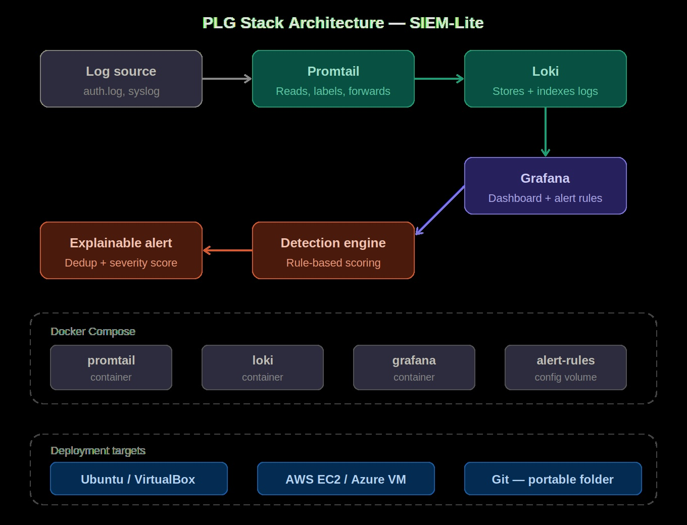
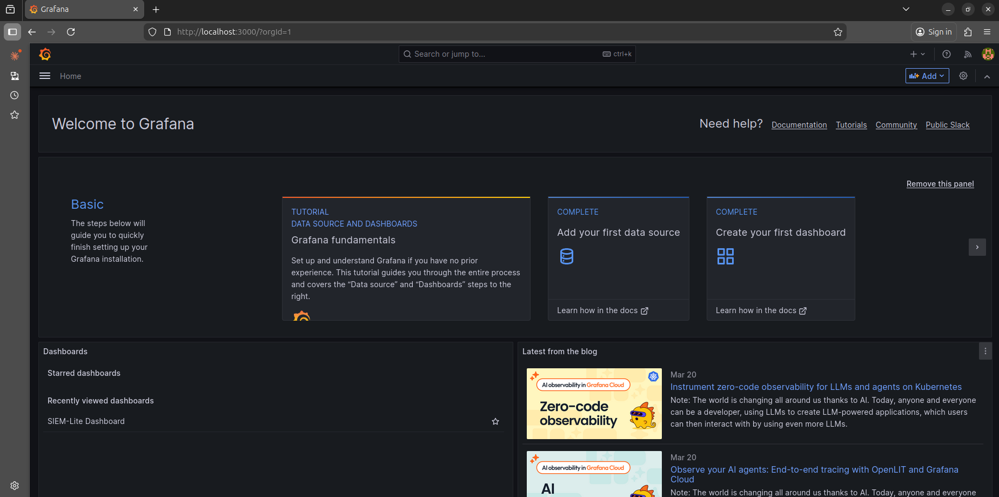
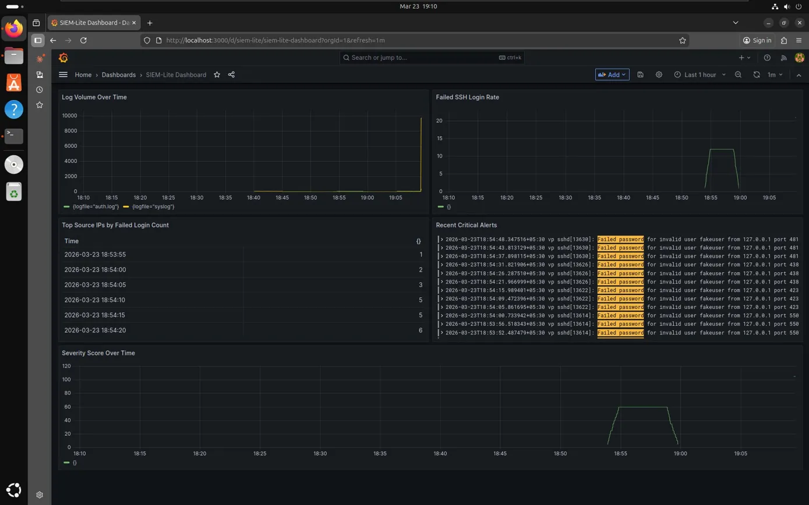

# SIEM-Lite: Cloud-Native Log Monitoring & Alerting System

[](https://www.docker.com/)
[](https://www.python.org/)
[](https://grafana.com/)
[](./LICENSE)


---

## Quick Start

```bash
git clone https://github.com/vpadival/siem-lite.git
cd siem-lite

# Using Make (recommended)
make install        # creates venv + installs deps
make dataset        # generates labeled training data
make train          # trains RF + Isolation Forest models
make test           # runs all unit + integration tests
make up             # starts Grafana + Loki + Promtail

# Or manually
python -m venv venv && source venv/bin/activate
cp .env.example .env
pip install -r requirements.txt
docker compose up -d
```

Access Grafana at `http://localhost:3000` (default: admin / changeme_in_production).

> **Parrot OS / Arch / minimal VMs (systems without flat log files):**
> ```bash
> sudo apt install -y rsyslog && sudo systemctl enable --now rsyslog
> sudo chmod o+r /var/log/auth.log /var/log/syslog
> ```

---

## Architecture

SIEM-Lite uses the PLG stack for real-time log monitoring with an ML-enhanced alert engine:

- **Promtail** — collects and forwards logs from the host to Loki.
- **Loki** — aggregates and indexes log streams.
- **Grafana** — visualises logs, rule-based alerts, and ML scores.
- **Alert Scorer** (`scripts/alert_scorer.py`) — regex rule engine with cooldown tracking and sliding-window brute-force detection.
- **ML Scorer** (`scripts/ml_scorer.py`) — Random Forest + Isolation Forest real-time classifier.
- **Unified Scorer** (`scripts/unified_scorer.py`) — fuses rule-based and ML signals into a single composite risk score per log line.
- **Shared Utils** (`scripts/utils.py`) — common helpers (log-path discovery, distro detection) used by all three scorers.



---

## Running the Scorers

### Unified scorer (rule-based + ML) — recommended

```bash
python scripts/unified_scorer.py
python scripts/unified_scorer.py --push-to-loki http://localhost:3100
python scripts/unified_scorer.py --ml-threshold 10 --brute-threshold 5 --brute-window 60
python scripts/unified_scorer.py --rules-only    # skip ML even if models exist
```

The unified scorer runs both engines on every line and emits a fused composite score. It degrades gracefully to rule-only mode if ML models are not yet trained, or when `--rules-only` is passed.

### Rule-based scorer only

```bash
python scripts/alert_scorer.py
python scripts/alert_scorer.py --brute-threshold 5 --brute-window 60
```

### ML scorer only

```bash
# Train models first if not done
make train
python scripts/ml_scorer.py
python scripts/ml_scorer.py --push-to-loki http://localhost:3100
```

---

## Detection Rules

Rules are defined in `rules/detection-rules.yml`. Each rule specifies a regex pattern, severity, score, and cooldown period.

| Rule | Signal | Severity | Score |
|---|---|---|---|
| SSH brute force | Failed SSH login (per-line; see brute-force detector below) | High | 5 |
| Privilege escalation | sudo usage | Medium | 3 |
| After-hours login | Login between 23:00–04:59 | Low | 1 |
| New user created | useradd / adduser events | Medium | 3 |
| Direct root login | SSH login as root | Critical | 10 |
| Repeated su failures | Failed su attempts | High | 5 |

### Sliding-Window Brute-Force Detection

The `BruteForceDetector` class in `alert_scorer.py` tracks failed SSH logins **per source IP** over a configurable sliding time window (default: 5 failures in 60 seconds) and fires a consolidated `HIGH` alert when the threshold is crossed. This replaces the previous per-line cooldown approach for brute-force detection.

```bash
# Customise thresholds
python scripts/alert_scorer.py --brute-threshold 10 --brute-window 120
```

---

## ML Pipeline

### Training

```bash
make dataset   # generates data/auth_logs_labeled.csv
make train     # trains models, saves to ml/models/, results to ml/results/
```

Or manually:
```bash
python data/generate_dataset.py --num-lines 50000 --output data/auth_logs_labeled.csv
cd ml && python train_and_evaluate.py --dataset ../data/auth_logs_labeled.csv
```

### Models

| Model | Type | Purpose |
|---|---|---|
| `ml/models/random_forest.joblib` | Supervised | Classify log line into 7 categories (normal + 6 attack types) |
| `ml/models/isolation_forest.joblib` | Unsupervised | Detect anomalous lines not matching the normal distribution |
| `ml/models/featurizer.joblib` | Transformer | Structured features + TF-IDF (serialised for inference) |
| `ml/models/label_encoder.joblib` | Encoder | Maps class indices to label strings |

### Results

All training results are committed to `ml/results/`:

- `rf_metrics.json` — accuracy, F1, precision, recall, CV scores
- `iso_metrics.json` — precision, recall, F1, TP/FP/TN/FN
- `rf_classification_report.txt` — per-class report
- `rf_confusion_matrix.png` — confusion matrix heatmap
- `rf_roc_curves.png` — one-vs-rest ROC curves
- `rf_feature_importance.png` — top-25 feature importances
- `iso_score_distribution.png` — normal vs anomaly score histogram

---

## Testing

```bash
make test               # all tests
make test-unit          # unit tests only
make test-integration   # end-to-end integration tests
make test-ml-scorer     # ml_scorer unit tests (composite score, Loki payload, threshold gating)
```

Test files:
- `scripts/test_alert_scorer.py` — unit tests for alert scorer, cooldown, rule loading, brute-force detector
- `scripts/test_ml_scorer.py` — unit tests for MLScorer predict contract, severity mapping, Loki payload structure, and threshold gating
- `ml/test_ml_pipeline.py` — unit tests for feature engineering and dataset generator
- `scripts/test_integration.py` — end-to-end tests: real YAML rules against realistic log lines, brute-force pipeline, unified scorer smoke test

---

## Live Demo

A step-by-step SSH attack demonstration guide (Parrot OS as target, Kali Linux as attacker)
is available in **[DEMO.md](./DEMO.md)**. It covers:
- Single SSH login detection (after-hours, root login)
- Brute-force detection via sliding-window counter
- Privilege escalation and new-user-creation alerts
- Hydra wordlist attack demonstration
- Grafana dashboard setup for real-time visualisation

---

## Screenshots

- **Grafana Dashboard**: 
- **Alert Output**: 

---

## Compatibility

| Distro | Log files | Notes |
|---|---|---|
| Ubuntu / Debian | `/var/log/auth.log`, `/var/log/syslog` | Works out of the box |
| Parrot OS | Same as Debian | Needs `rsyslog` installed first |
| RHEL / CentOS / Fedora | `/var/log/secure`, `/var/log/messages` | Works out of the box |
| Arch Linux | Requires `rsyslog` | Journal-only by default |
| macOS | Any readable log file | No inotify — uses polling |
| WSL2 | Requires `rsyslog` | Journal not available |

---

## Cloud Deployment

### AWS EC2 / Azure VM

```bash
git clone https://github.com/vpadival/siem-lite.git
cd siem-lite
cp .env.example .env   # set GF_PASSWORD
docker compose up -d
```

Access Grafana at `http://<Public-IP>:3000`.

---

## Troubleshooting

| Problem | Fix |
|---|---|
| `No log files found` | Install rsyslog (see Quick Start) |
| `/var/log/auth.log` permission denied | `sudo chmod o+r /var/log/auth.log /var/log/syslog` |
| Loki exits with code 1 | `docker compose down -v && docker compose up -d` |
| Port 3000 already in use | Change `"3000:3000"` to `"3001:3000"` in `docker-compose.yml` |
| `ML models not found` | Run `make train` before using `ml_scorer.py` or `unified_scorer.py` |
| inotify watch limit hit | `echo fs.inotify.max_user_watches=524288 \| sudo tee -a /etc/sysctl.conf && sudo sysctl -p` |
| No logs in Grafana after startup | Wait 30s — Loki needs time to index the first entries |

---

## SDG Alignment

- **SDG 9** — Industry, Innovation, and Infrastructure: promotes resilient infrastructure through robust log monitoring.
- **SDG 16** — Peace, Justice, and Strong Institutions: enhances security and transparency by detecting and mitigating threats.

---

## Contributing

1. Fork the repository.
2. Create a feature branch.
3. Run `make test` and ensure all tests pass.
4. Submit a pull request with a detailed description.

## License

This project is licensed under the [MIT License](./LICENSE).